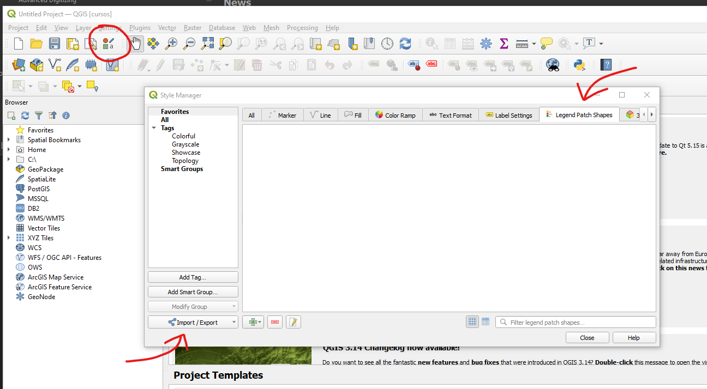
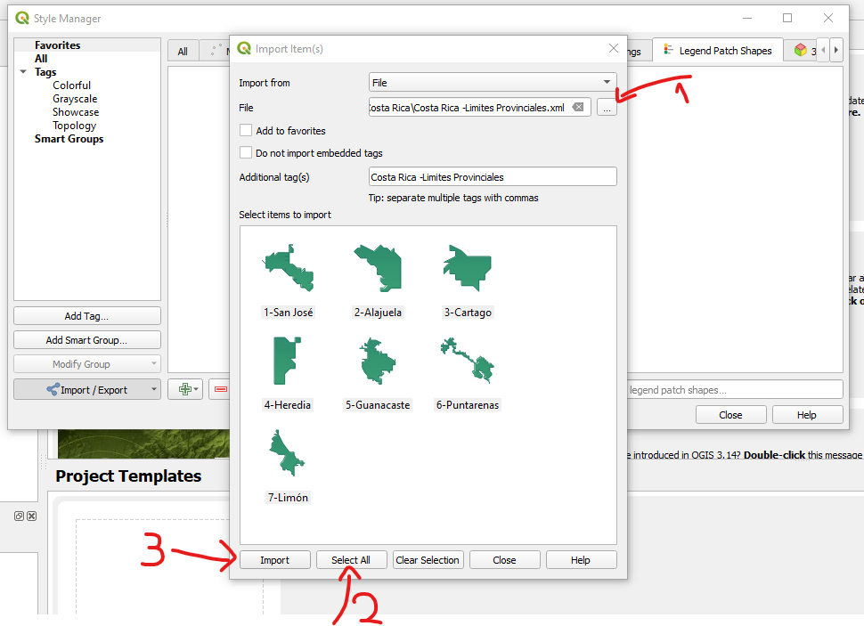
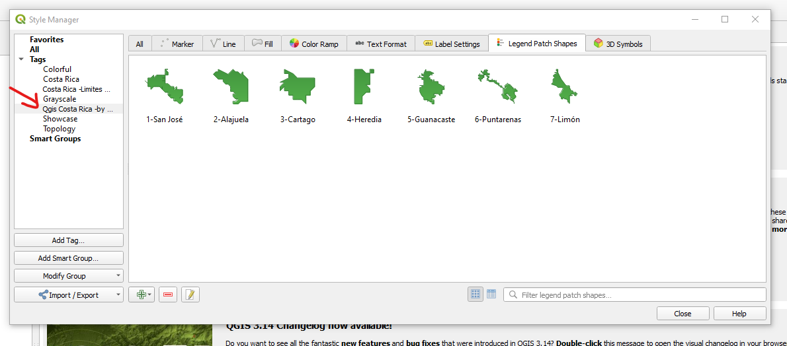

# Legend Patches Shapes Costa Rica

## Info
Author: Javier Chinchilla M.

Versión QGIS 3.14 o 3.16

## Descripción

En esta colaboración te damos unos "Legend Patches Shapes" hechos a
partir de los limites provinciales de Costa Rica que se pueden utilizar
en la simbología de tus mapas.

Inspirado en el Blog:

[Come realizzare patch Legend per QGIS 3.14](https://pigrecoinfinito.com/2020/04/29/come-realizzare-patch-legend-per-qgis-3-14/)

## Como usar

* Paso 1: Descarga el archivo "costa_rica_limites_provinciales.xml" 

    [costa_rica_limites_provinciales.xml](costa_rica_limites_provinciales.xml)
  
* Paso 2: Utiliza el administrador de estilos para importar el archivo xml

* Paso 3: Importa el archivo xml seleccionando todas los elementos

* Paso 4:Ya tienes importado los patch y ya puedes usarlos en la simbología de tus mapas
 

## Prender más

[How to make Legend Patches shapes](https://www.youtube.com/watch?v=WaDbM28qNVg)

### Maintainer
Eduardo Rojas Rodriguez

Contact: info@qgiscr.org